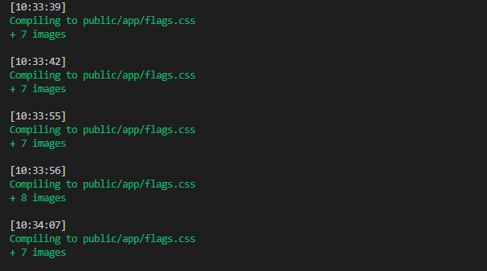

# svgbundler | The old C version is [here](/c-cli/)

Basically, it takes a bunch of vector images and embedds them into single `.css` file.

We do that so our apps don't make hundreds of http requests just to load UI icons.

Just like this:

`background-image: url(/test/src/svgs/map-marker.svg)`

... becomes ...

`background-image: url("data:image/svg+xml...");`

## How to use

1. Install
	
	`npm i @maddsua/svgbundler`

2. Place your `.svg` images somewhere in projects directory

3. Add a npm script like this:

	`"svgs": "svgbundler -m -r -f /test/src/form:test/public/ui.css test/style.css:test/public/style.css"`

	**In detail:**

	1. `/test/svgs/:test/public/ui.css`
	
		will find all the svg files in the `/test/svgs/` and bundle them to `test/public/ui.css`.

		Now just add classes to html, instead of adding background images via css.

	2. `"test/style.css:test/public/style.css"`
	
		will find all the references to .svg files in `"test/style.css"`, load, minify and bundle them to `"test/public/style.css"`.
		
		Essentially, it will replace `url('/path/icon.svg')` with `url("data:image/svg+xml,%3C%3Fxml%2....")`

	Note that paths are relative, `/` will resolve to the directory, from which nodejs was called, being project root in most cases.

### NEW:

You can now specify files directly in package.json:

```
...
"svgbundler": {
    "files": [
        {
            "from": "test/assets",
            "to": "test/public/countries.css",
            "override": true,
            "prefix": "ccode",
            "selector": "valid"
        }
    ]
}
...
```

Or in `svgbundler.json`:

```
{
	"files": [...]
}
```

## Flag arguments

1. `--minify` | `-m` : Remove unnecessary meta attributes from svg

2. `--flatten` | `-f` : Replace dashes with underscores,

	like here: `"dir/file-one.svg"` --> `".dir-file_one"`

3. `--prefix=[prefix]` : Add a prefix css class. Adding 'ui-' will result in '.ui-image...'

4. `--watch` | `-w` : Watch for file changes

5. `--silent` | `-s` : Don't list all the input filed, silent mode

6. `--package` | `-p` : Load files from package.json (format specified above)


---
## See tests directory for more
[📂 tests here](test/)

`npm test` command is also available

...and a screenshot of it working in watch mode as a cherry on top:


