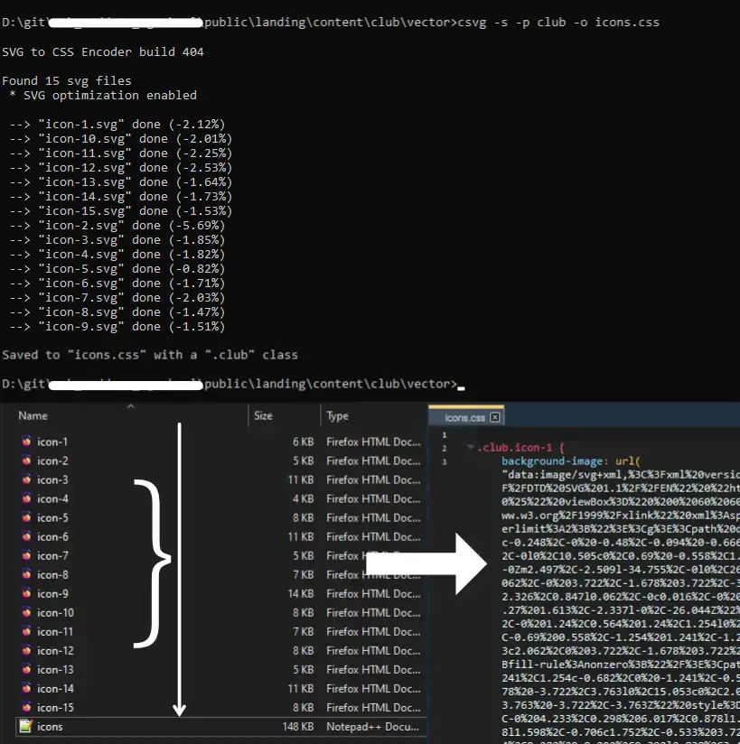

# SVG to CSS Encoder - Deprecated

### Assuming that bundling svg images is a part of web developer's work, you probably already have NodeJS installed, so you can check out a much better tool - [svgbundler the NPM package](https://www.npmjs.com/package/@maddsua/svgbundler)

---

Yeah, writing it in C was cool as heck, but there is no point to prefer this version, as long as not trying to process a quadrillion files at once.

Just use JS version, it's much more handy.

### Usage

1. Open command line in directory that contains `.svg` files. If you don't specify any input files, on windows, it'll try to find them in the current dir
2. Run `csvg`
3. Observe `result.css` appering in that folder. It contains ready to use CSS code
4. Use that code in your product
5. ????
6. Profit!




### Flags

`-i` : input file. Usage: `-i vector.svg`

`-o` : output file. Usage: `-o style.css`

`-p` : adds another CSS class to the image. Usage: `-p vectorImage`

`-s` : enables code optimization (gets rid of metadata)

`-r` : open file in a shell when done


### CLI example:

```
D:\git\svg-to-css-encoder\src>csvg -s -r -o vector.css -p icon

SVG to CSS Encoder build 60

Found 1 svg files

 --> "orig.svg" done

Saved to "vector.css" with a ".icon" class

```

**Results in:**

Output file: `vector.css:`

```
.icon.orig {
	background-image: url("data:image/svg+xml,%3C%3Fxml......%2Fsvg%3E");
}
```


## Size optimizations

Please note, that the resulting `.css` file size fill be slightly larger, than original `.svg`. This happens due to a special character encoding, where one symbol `"` (quote sign) convert to a sequence of 3 symbols: `%22`. This conversion doesn't apply to every character, like alphanumeric ones that won't be converted

## If something is broken

If something is broken, this is probably because of size optimization features. This part of the program is probably cursed. Try to run again without it ( no `-s` key )

